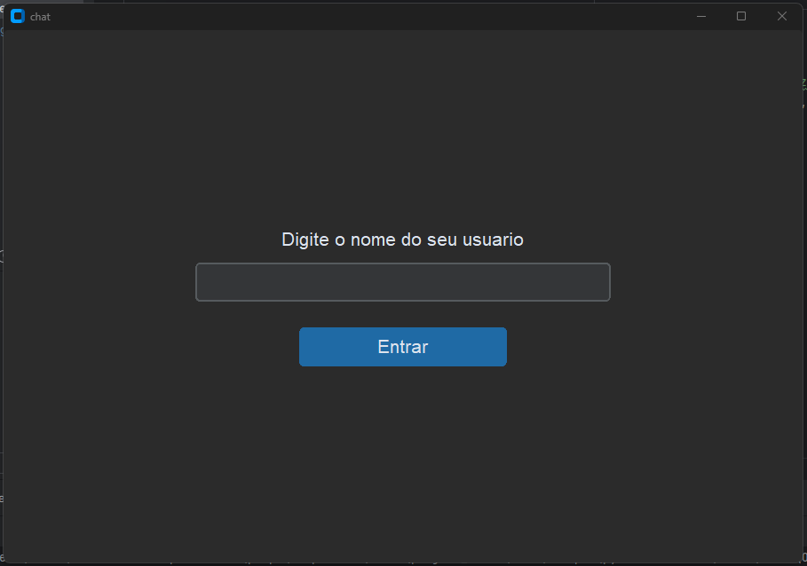
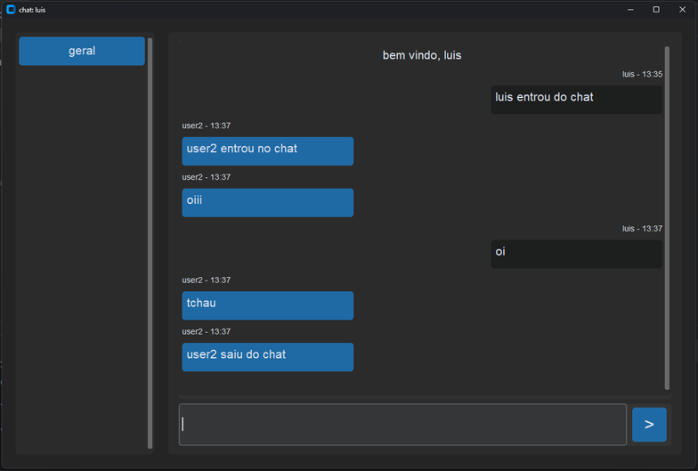

# pyChat - Chat with Interface using Socket

[In English](README.md) | [Em Português](README_PTBR.md)

## Example Image





## Overview

This is a client-server chat project with a graphical interface, enabling communication between multiple computers using sockets in Python.

## Features

- **Server:**
  - Manages client connections.
  - Forwards messages between clients.
  - Allows private communication between users.

- **Client:**
  - User-friendly graphical interface.
  - Sending messages to all participants.
  - Sending private messages to specific users.

## Requirements

- **Server and Client:**
  - Python 3.x

- **Client:**
  - `customtkinter` library (installable via `pip install customtkinter`)

## How to Use

1. **Clone the repository:**

   ```bash
   git clone https://github.com/luis-ota/pyChat.git
   ```

2. **Server Configuration:**
   - In `servidor.py`, specify the IP of the machine that will be the server.
   - Disable the server firewall to allow connections.

3. **Client Configuration:**
   - Put the server's IP in the client's code.

4. **Start the Server:**
   - Execute the `servidor.py` script.

5. **Start the Clients:**
   - Execute the `app/main.py` script on each machine that wants to participate in the chat.

Now, with the server and clients running, users can communicate with each other through the chat. Ensure that all machines are on the same network to ensure proper communication.
