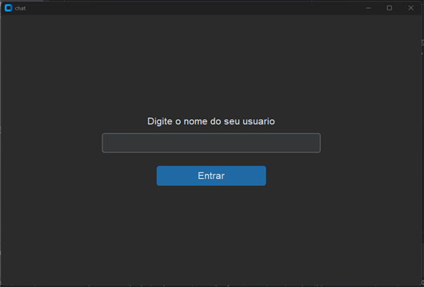
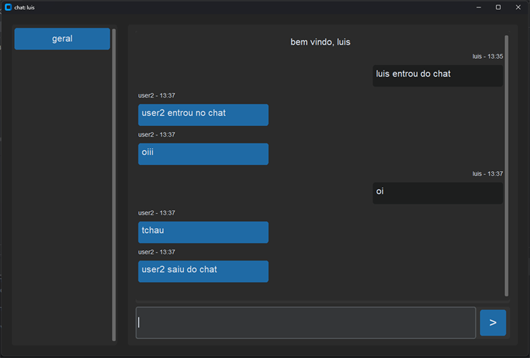

# pyChat - Chat with Interface using Socket

In [English](README.md) | Em [Português](README_PTBR.md)

## Example Image

|  |  |
|------------------------|----------------------|

##

This is a client-server chat project with a graphical interface, enabling communication between multiple computers using Python sockets.

## Overview

This project consists of two main parts: the server and the client. The server manages connections between clients and forwards messages, while the client provides a graphical interface for users to participate in the chat.

## Features

- **Server:**
  - Manages client connections.
  - Forwards messages between clients.
  - Allows private communication between users.

- **Client:**
  - User-friendly graphical interface.
  - Sends messages to all participants.
  - Sends private messages to specific users.

## Requirements

- **Server and Client:**
  - Python 3.x

- **Client:**
  - `customtkinter` library (installable via `pip install customtkinter`)

## How to Use

1. **Clone the repository:**

   ```bash
   git clone https://github.com/luis-ota/pyChat.git
   ```

2. **Server Configuration:**
   - Disable the firewall on the server PC to allow connections.

3. **Start the Server:**
   - Run the `servidor.py` script.

4. **Start the Clients:**
   - Run the `app/main.py` script on each machine that wants to participate in the chat, or run it twice on the same machine to test.

Now, with the server and clients running, users can communicate with each other through the chat. Make sure all machines are on the same network to ensure proper communication.